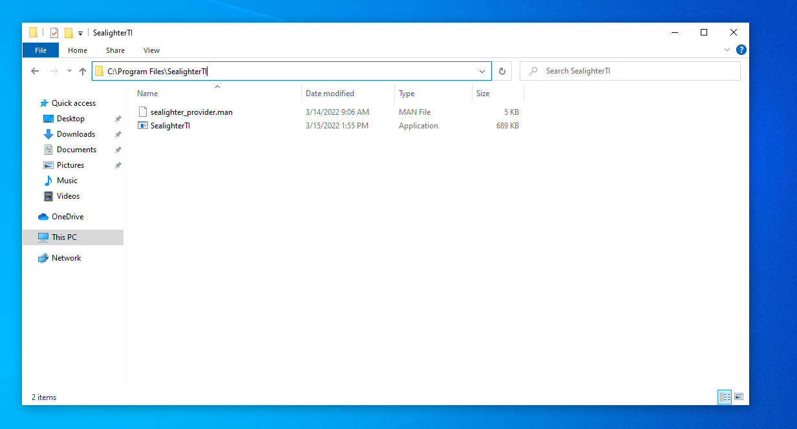
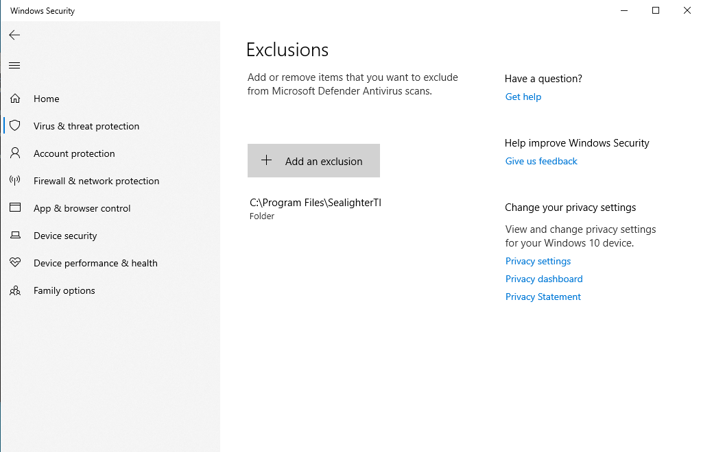
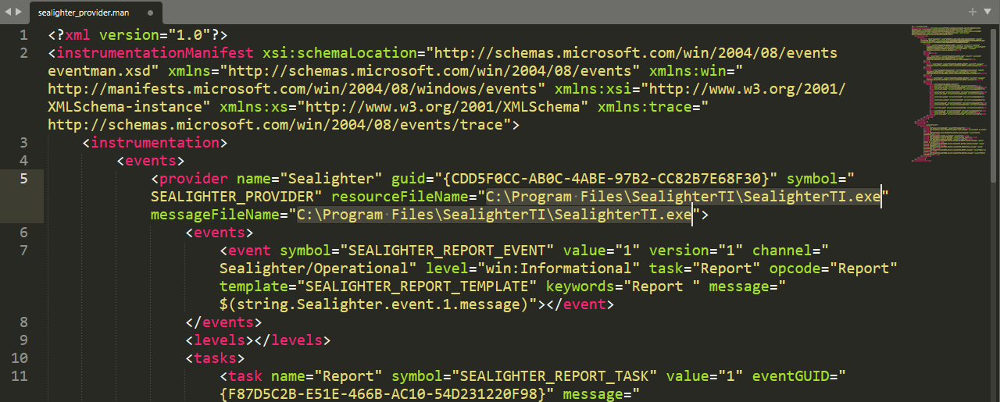
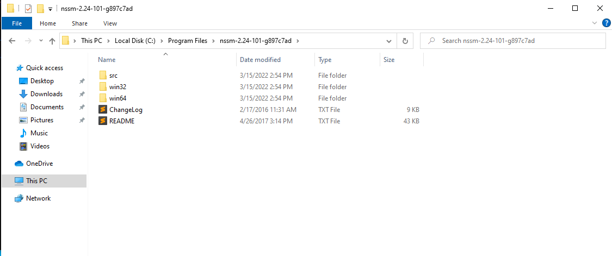
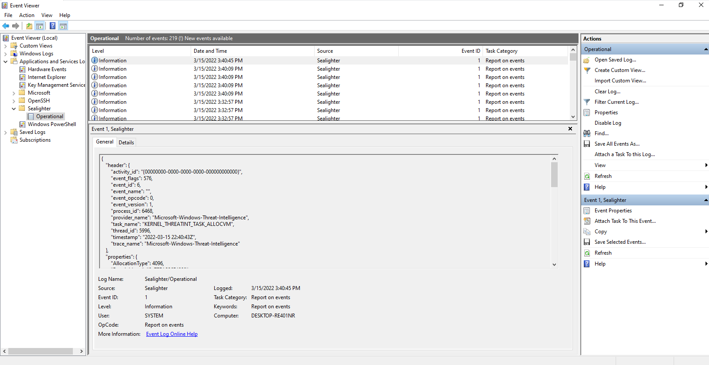
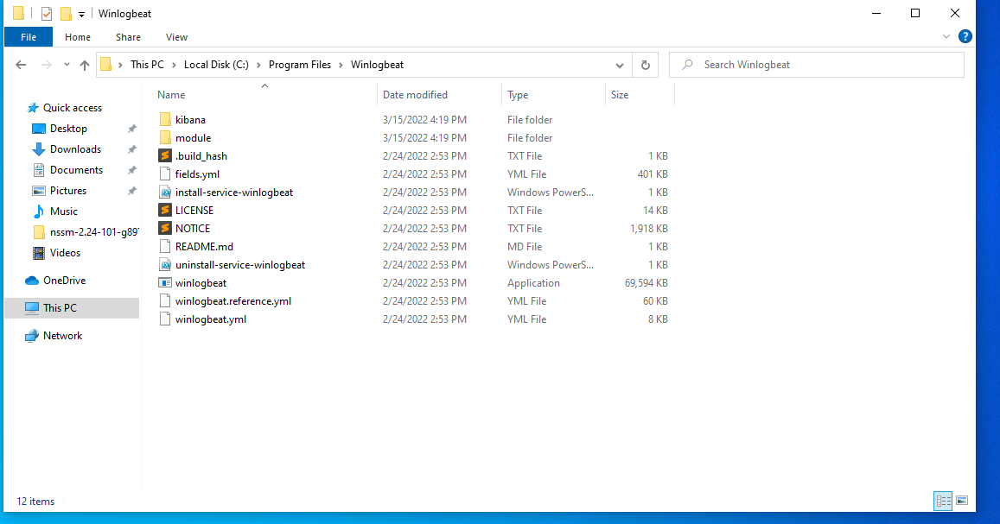
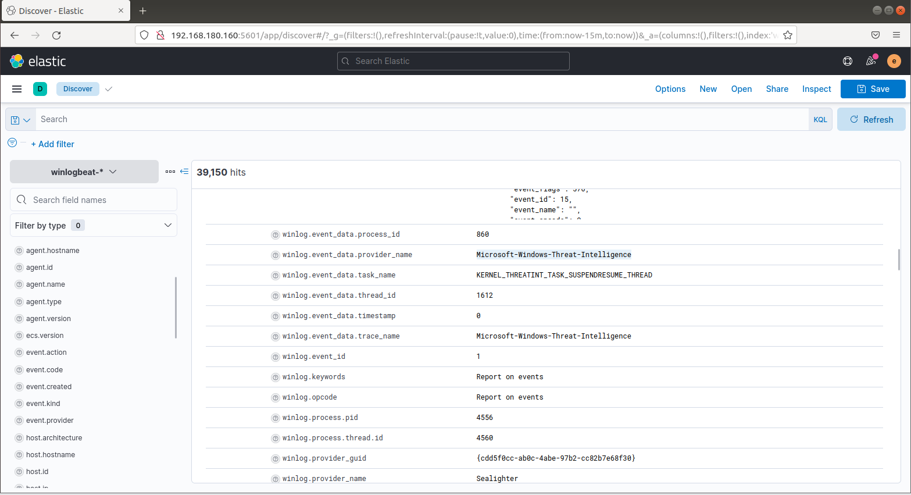

Before jumping to the technical steps, let's talk a little bit about the Threat Intelligence ETW(Event Tracing for Windows) Provider.


> The Microsoft-Windows-Threat-Intelligence ETW Provider is an excellent tool to detect process injection, and other type of attacks. Unlike usermode hooking or in-process ETW Providers, avoiding or tampering with the Threat-Intelligence is very difficult.
> 
> However, to subscribe to this Provider requires a process with very special privileges, marked as Protected Process Light (PPL) 'Anti-Malware' or higher. To legitimately run a program at this level you must submit a driver to Microsoft to be co-signed by them, something not everyone has the inclination or reputation to do.
>
> source : [pathtofile](https://github.com/pathtofile/SealighterTI#overview)


### Required Tools

*  Windows 10 VM
*  ELK stack
*  WinlogBeat
*  NSSM
*  SealighterTI

**DISCLAMER**:


In this article, I am not going to cover the deployment of the ELK stack. I may write another blog talking about multiple ways to deploy it in your own lab. But mainly here I am basing it on This [docker-compose](https://github.com/deviantony/docker-elk) which will do all the boring configuration stuff on your behalf.

## Walkthrough


#### Step 1
On a windows 10 VM, download the Assets from the links below :

+ [SealighterTI.exe + sealighter_provider.man](https://github.com/pathtofile/SealighterTI/releases)

**PS:** Disable windows defender before downloading the SealighterTI.exe, because it will consider it malicious.

Otherwise, you can clone the repository on your machine and build the exe. For my case, I just downloaded the pre-built binarie, it works fine.

 Check the [SealighterTI Project](https://github.com/pathtofile/SealighterTI) for more details. 
 
 
#### Step 2

Create a repository on the C:\Program Files\ location, and move the two downloaded files.



Then, go to Microsoft windows defender, and add that folder to windows defender exclusion.


Select the SealighterTI folder and click Ok.



after that you can activate windows defender real-time protection again.


#### Step 3

First Open up the sealigher_provider.man in a text editor, and replace all uses of `!!SEALIGHTER_LOCATION!!` with the full path to the SealighterTI.exe binary.



 Then from an elevated command prompt run:

```bash
wevtutil im path/to/sealigher_provider.man
```


#### Step 4

Download [NSSM](https://nssm.cc/ci/nssm-2.24-101-g897c7ad.zip) ,Extract it and move it to `C:\Program Files\`.

> **What is nssm.exe?**
> 
> The genuine nssm.exe file is a software component of NSSM by Iian Patterson.
> *Non-Sucking Service Manager* is a service manager for Microsoft Windows. **Nssm.exe** launches the Non-Sucking Service Manager program. This is not an essential Windows process and can be disabled if known to create problems. NSSM is a free utility that manages background and foreground services and processes. The program can be set to automatically restart failing services. The program also logs all progress in an Event Log, making it easier to identify applications that aren't behaving as they should. 

We will use NSSM to run SealighterTI as a service automatically without the need to start it every time you reboot your machine.



open an Administrator command prompt, change directory to the location of the nssm exe, and run the following command.

`nssm install SealighterTI`


a window will pop-up as the picture shows above. you just have to fill in the path of the sealighterTI folder and executable and the argument `-d` . Then click on **Install service** .


And finally the SealighterTI service is installed succesfully.


#### Step 5

Open windows `services.msc` , Find SealighterTI service and click on Start.


and you're done.

Now go to Event Viewer and check The Sealighter/Operational logs.



**NOTE :** 

After running the SealighterTI service, you'll discover that the number of event logs on event viewer doesn't bypass 5** event, and you may think that the TI provider doesn't log correctly.however that is not correct,But you just need to configure the Log proprieties on the right panel on event viewer, then change `The maximum log size to a bigger number ^_^`


#### Step 6

Now it's Time to ship Microsoft-Windows-Threat-Intelligence ETW provider logs to ELK stack.

+ Download [Winlogbeat](https://www.elastic.co/fr/downloads/beats/winlogbeat) zip and extract it.
+ Create a Folder on `C:\Program Files\` and name it winlogbeat and move all the extracted files from the zip folder. 



+ Open `winlogbeat.yml` and add this line under the winlogbeat.event_logs .

```yaml
winlogbeat.event_logs:

  - name: Sealighter/Operational
```
More configuration details can be found on the official elastic website.

+ Open powershell as administrator and change directory to `C:\Program Files\Winlogbeat`, and run commands below :

```powershell
PowerShell.exe -ExecutionPolicy UnRestricted -File .\install-service-winlogbeat.ps1
.\winlogbeat.exe test config -c .\winlogbeat.yml -e
.\winlogbeat.exe setup -e
Start-Service winlogbeat

```

Finally, go to ELK and check, you'll see all the logs Ingested successfully to Kibana web Interface.




## Conclusion

Today, we managed to succesfully view and consume the Microsoft-Windows-Threat-Intelligence Provider events log, and ship them To ELK stack. In the Next post, I will show you how we can take advantage of this provider to detect some adversary attack like Process Injection, and to understand why Microsoft's "Threat Intelligence Tracing" is useful and much needed in detection of modern and often obscure injection techniques.

